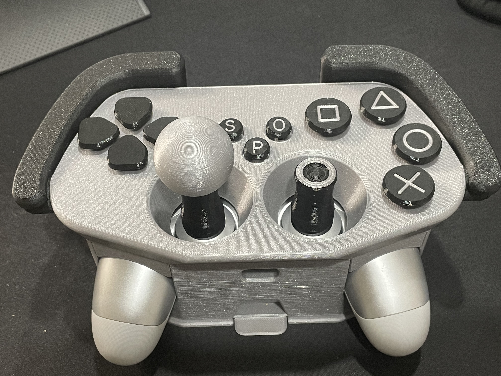

# Adaptive Case for PS4 Controller
The Adaptive Case for PS4 Controller is an inexpensive and non-destructive controller modification designed to make the stock PS4 controller more accessible. This device aims to assist those with limited hand dexterity by enlarging and spreading out the buttons on the PS4 controller. This device can be mounted to a surface so that both hands can freely operate the controls.   

## More info at
- [Makers Making Change Project Page](https://makersmakingchange.com/project/adaptive-case-for-ps4-controller)

## How to Obtain an Adaptive Case for PS4 Controller
### 1. Do it Yourself (DIY) or Do it Together (DIT)

This is an open-source assistive technology, so anyone is free to build it. All of the files and instructions required to build the Adaptive Case for PS4 Controller are contained within this repository. Refer to the Maker Checklist below.

### 2. Request a build of this device

If you would like to obtain an Adaptive Case for PS4 Controller , you may submit a build request through the [MMC Library Page](https://makersmakingchange.com/project/adaptive-case-for-ps4-controller/). The requestor is responsible for the cost of materials and any shipping.

### 3. How to build this device for someone else

If you have the skills and equipment to build this device, and would like to donate your time to create the switch for someone who needs it, visit the [MMC Maker Wanted](https://makersmakingchange.com/maker-wanted/) section.

## Getting Started

### 1. Read the Makers Checklist

The Makers Checklist contains a list of tasks to complete to build the device.

### 2. Print the 3D Printable components

All of the files and individual print files can be in the [/Build_Files/3D_Printing_Files](/Build_Files/3D_Printing_Files/) folder.

### 3. Assemble the Adaptive Case for PS4 Controller

Reference the [Assembly Guide](/Documentation/Adaptive_Case_for_Ps4_Controller_Assembly_Guide.pdf) for the tools and steps required to build each portion.

## Files
### Documentation
| Document             | Version | Link |
|----------------------|---------|------|
| Design Rationale     | 1.0     | [Adaptive_Case_for_Ps4_Controller_Design_Rationale](/Documentation/Adaptive_Case_for_Ps4_Controller_Design_Rationale.pdf)     |
| Maker Checklist      | 1.0     | [Adaptive_Case_for_Ps4_Controller_Maker_Checklist](/Documentation/Adaptive_Case_for_Ps4_Controller_Maker_Checklist.pdf)     |
| Bill of Materials    | 1.0     | [Adaptive_Case_for_Ps4_Controller_Bill_of_Materials](/Documentation/Adaptive_Case_for_Ps4_Controller_BOM.xlsx)     |
| 3D Printing Guide    | 1.0     | [Adaptive_Case_for_Ps4_Controller_3D_Printing_Guide](/Documentation/Adaptive_Case_for_Ps4_Controller_3D_Printing_Guide.pdf)   |
| Assembly Guide       | 1.0     | [Adaptive_Case_for_Ps4_Controller_Assembly_Guide](/Documentation/Adaptive_Case_for_Ps4_Controller_Assembly_Guide.pdf)     |
| User Guide           | 1.0     | [Adaptive_Case_for_Ps4_Controller_User_Guide](/Documentation/Adaptive_Case_for_Ps4_Controller_User_Guide.pdf)    |
| Changelog            | 1.0     | [Adaptive_Case_for_Ps4_Controller_Changelog](/Documentation/Adaptive_Case_for_Ps4_Controller_Changelog.pdf)     |

### Design Files
- [CAD Files](/Design_Files)

### Build Files
 - [3D Printing Files](/Build_Files/3D_Printing_Files)

## Attribution

Design: [Cisco](https://www.printables.com/social/28161-cisco/models) posted on [Printables](https://www.printables.com/model/91884-ps4-case-adapter)

Documentation by Neil Squire / Makers Making Change.

## License
Everything needed or used to design, make, test, or prepare theAdaptive_Case_for_Ps4_Controller is licensed under the CERN 2.0 Permissive license <https://ohwr.org/project/cernohl/wikis/Documents/CERN-OHL-version-2> (CERN-OHL-P) . 

Accompanying material such as instruction manuals, videos, and other copyrightable works that are useful but not necessary to design, make, test, or prepare the Adaptive_Case_for_Ps4_Controller are published under a Creative Commons Attribution-ShareAlike 4.0 license https://creativecommons.org/licenses/by-sa/4.0/ (CC BY-SA 4.0).

---

<!-- ABOUT MMC START -->
## About Makers Making Change

Makers Making Change is a program of [Neil Squire](https://www.neilsquire.ca/), a Canadian non-profit that uses technology, knowledge, and passion to empower people with disabilities.

Makers Making Change leverages the capacity of community based Makers, Disability Professionals and Volunteers to develop and deliver affordable Open Source Assistive Technologies.

 - Website: [www.MakersMakingChange.com](https://www.makersmakingchange.com/)
 - GitHub: [makersmakingchange](https://github.com/makersmakingchange)
 - Bluesky: [@makersmakingchange.bsky.social](https://bsky.app/profile/makersmakingchange.bsky.social)
 - Instagram: [@makersmakingchange](https://www.instagram.com/makersmakingchange)
 - Facebook: [makersmakechange](https://www.facebook.com/makersmakechange)
 - LinkedIn: [Neil Squire Society](https://www.linkedin.com/company/neil-squire-society/)
 - Thingiverse: [makersmakingchange](https://www.thingiverse.com/makersmakingchange/about)
 - Printables: [MakersMakingChange](https://www.printables.com/@MakersMakingChange)

### Contact Us
For technical questions, to get involved, or to share your experience we encourage you to [visit our website](https://www.makersmakingchange.com/) or [contact us](https://www.makersmakingchange.com/s/contact).
<!-- ABOUT MMC END -->
